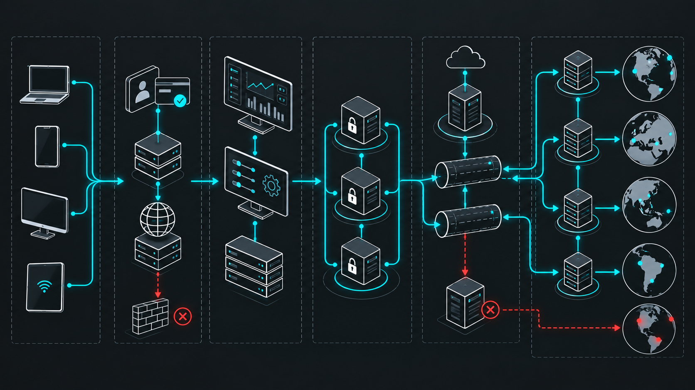

# VPNOpsNyx

[English](README.md) | [فارسی](README.fa.md) | [Русский](README.ru.md) | [简体中文](README.zh-CN.md)


یک AI Skill برای مدیریت VPN، پراکسی، پنل، نود، تونل و عملیات شبکه؛ قابل استفاده در Claude، Codex، ChatGPT و سایر AI coding agentها.

VPNOpsNyx خودش پروتکل VPN، پیاده‌سازی تونل یا fork یک پنل نیست. این پروژه یک پایگاه دانش عملیاتی ساختاریافته است که به AI Agentها کمک می‌کند زیرساخت VPN و پراکسی را بررسی، طراحی، نصب، اعتبارسنجی، عیب‌یابی و مستندسازی کنند.

## پوشش پروژه

- پنل‌ها و control planeها: 3x-ui، PasarGuard، Marzban، Marzneshin، Hiddify، Remnawave، S-UI، پنل‌های WireGuard و پروژه‌های مرتبط.
- Coreها و پروتکل‌ها: Xray-core، sing-box، WireGuard، AmneziaWG، Hysteria2، TUIC، Trojan، VMess، VLESS، Shadowsocks، MTProto و Reality/TLS.
- تونل‌ها و رله‌ها: Backhaul، [BackPack](https://github.com/AminMGMT/BackPack)، Rathole، Paqet، FRP، DaggerConnect، DNAT/nftables، GRE، GRE6، 6TO4، SIT، IPIP، Geneve، WireGuard relay و SSH reverse tunnel.
- عملیات: health check، تست واقعی مسیر داده، SSL، DNS، firewall، lifecycle نود، ظرفیت، incident، migration و rollback.
- کامیونیتی: فهرست کامل پروفایل‌ها و ریپازیتوری‌های عمومی معرفی‌شده، همراه با لینک مستقیم و وضعیت اعتبارسنجی.



## نصب به‌عنوان Skill

### Claude

```bash
git clone https://github.com/nyxon-tech/vpnopsnyx ~/.claude/skills/vpnopsnyx
```

### Codex

```bash
git clone https://github.com/nyxon-tech/vpnopsnyx ~/.codex/skills/vpnopsnyx
```

### سایر AI Agentها

ریپازیتوری را در پوشه skill یا plugin ابزار خود clone کنید و فایل `SKILL.md` را به‌عنوان نقطه شروع معرفی کنید. مستندات Markdown و registryهای JSON طوری طراحی شده‌اند که در runtimeهای مختلف قابل استفاده باشند.

## فایل‌های مهم

- `SKILL.md`: نقطه شروع Agent، قواعد امنیتی و مسیر دسترسی به منابع.
- `docs/ecosystem-guide.md`: تفاوت پنل، core، VPN، reverse tunnel، overlay، client و routing data.
- `docs/install-recipes.md`: دستورهای نصب بررسی‌شده همراه با preflight و verification.
- `docs/networking-recipes.md`: راهنمای DNS، firewall، IPv4/IPv6، BBR، mirror و hosts file.
- `docs/community-review.md`: بررسی repo-by-repo پروژه‌های کامیونیتی.
- `docs/sources.md`: گزارش اعتبارسنجی منابع و لینک‌ها.
- `registries/ecosystem.json`: فهرست اصلی پنل‌ها، coreها، تونل‌ها، clientها، installerها و routing data.
- `registries/community-repositories.json`: snapshot کامل ۱۱۱ ریپازیتوری عمومی حساب‌های معرفی‌شده.
- `references/`: راهنماهای عملیاتی معماری، پنل، تونل، Cloudflare، incident، capacity و lifecycle نود.
- `templates/fleet-inventory.example.md`: نمونه inventory خصوصی؛ نسخه تکمیل‌شده را commit نکنید.
- `guides/panels/`: راهنمای اختصاصی نصب، API، backup، upgrade و troubleshooting پنل‌های اصلی.
- `guides/tunnels/`: راهنمای مرحله‌به‌مرحله Tunnelها همراه با verification و rollback.
- `.github/workflows/`: کنترل خودکار JSON، ساختار Skill، لینک‌ها، الگوهای Secret و بازبینی ماهانه منابع.
- `docs/agent-compatibility.md`: سازگاری Codex، Claude و سایر Agentها.
- `CHANGELOG.md`: تاریخچه نسخه‌ها و تغییرات.

## وضعیت منابع

- `verified`: لینک یا منبع عمومی بررسی شده است.
- `official`: منبع توسط سازنده یا سازمان اصلی نگهداری می‌شود.
- `third-party`: ابزار شخص ثالث است و باید قبل از اجرا بررسی شود.
- `community`: پروژه عمومی کامیونیتی است و وجود آن به معنی تأیید امنیتی نیست.
- `unverified`: منبع رسمی یا اطلاعات کافی برای اتوماسیون تأیید نشده است.
- `deprecated`: پروژه قدیمی، متوقف یا جایگزین شده است.

## مدل امنیتی

- Agent تا زمان تأیید صریح اپراتور باید فقط بررسی‌های read-only انجام دهد.
- password، API token، private key، tunnel token، subscription URL و inventory واقعی سرورها نباید داخل chat یا repository ذخیره شوند.
- دستورهای `curl | bash` و installerهای remote باید مانند اجرای کد خارجی بررسی شوند.
- برای محیط production از tag، commit یا release ثابت استفاده کنید و قبل از تغییر backup و rollback آماده داشته باشید.
- بعد از تغییر شبکه، فعال بودن service کافی نیست؛ مسیر واقعی داده باید تست شود.
- ابزارهای نامطمئن، community یا third-party باید با برچسب روشن گزارش شوند.

## قدردانی از کامیونیتی

VPNOpsNyx از افرادی که با پروژه‌های عمومی خود به توسعه ابزارهای VPN، پراکسی،
مسیریابی، subscription و دسترسی آزادتر به اینترنت کمک کرده‌اند قدردانی می‌کند.
پروژه‌های این افراد در registry و بررسی منابع استفاده شده‌اند:

- [erfjabplus](https://github.com/erfjabplus)
- [AsanFillter](https://github.com/AsanFillter)
- [rezazoom](https://github.com/rezazoom)
- [azavaxhuman](https://github.com/azavaxhuman)
- [ircfspace](https://github.com/ircfspace)
- [primeZdev](https://github.com/primeZdev)
- [ppouria](https://github.com/ppouria)
- [MHSanaei](https://github.com/MHSanaei)

همچنین از سازندگان و نگه‌دارندگان پنل‌ها، تونل‌ها و ابزارهایی که در VPNOpsNyx
به آن‌ها ارجاع شده است قدردانی می‌کنیم:

- [Azumi67](https://github.com/Azumi67)
- [PasarGuard](https://github.com/PasarGuard)
- [vpaneladmin](https://github.com/vpaneladmin)
- [Gozargah](https://github.com/Gozargah)
- [marzneshin](https://github.com/marzneshin)
- [hiddify](https://github.com/hiddify)
- [remnawave](https://github.com/remnawave)
- [alireza0](https://github.com/alireza0)
- [Musixal](https://github.com/Musixal)
- [behzadea12](https://github.com/behzadea12)
- [opiran-club](https://github.com/opiran-club)
- [itsFLoKi](https://github.com/itsFLoKi)
- [AminMGMT](https://github.com/AminMGMT)

از تمام کسانی که برای باز و در دسترس ماندن اینترنت ابزار می‌سازند و دانش خود را
منتشر می‌کنند سپاسگزاریم. حضور در این فهرست به معنی تأیید امنیتی تمام پروژه‌های
یک حساب نیست؛ جزئیات هر ریپو در `docs/community-review.md` ثبت شده است.

## Fork و مشارکت

**VPNOpsNyx را Fork کنید و در تکمیل این پایگاه دانش مشترک سهیم شوید.** اضافه‌کردن
پنل یا تونل جدید، اصلاح لینک‌ها، آموزش نصب معتبر، rollback امن، تجربه عیب‌یابی،
ترجمه و بهبود مستندات پذیرفته می‌شود.

1. بالای صفحه روی **Fork** بزنید.
2. داخل Fork خود یک branch بسازید.
3. تغییر را همراه با لینک منابع معتبر انجام دهید.
4. برای `nyxon-tech/vpnopsnyx` یک Pull Request بفرستید.

قبل از ارسال، [CONTRIBUTING.md](CONTRIBUTING.md) را بخوانید. هیچ password، token،
private key، subscription URL، IP inventory واقعی یا اطلاعات کاربران را commit
نکنید.

## مجوز

MIT
